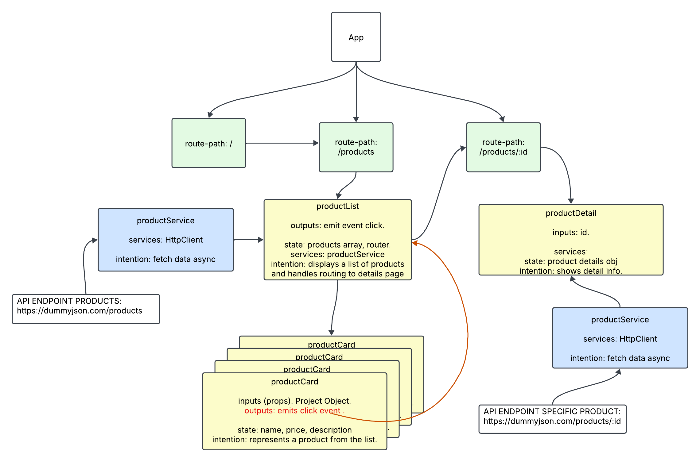

# ProductAppCaseware

To start the application locally, run:

```bash
ng serve
```

## Introduction

The application was created with modern angular features and syntax (signals, input, output, @for).




## Building

To build the project run:

```bash
ng build
```

This will compile your project and store the build artifacts in the `dist/` directory. By default, the production build optimizes your application for performance and speed.
